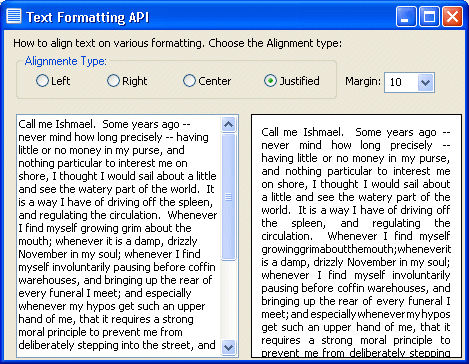



## Text Formatting API

### Description

Formatting text with various alignment and margins. The standard TextWidth is not accurate, specially if you want text justified exactly.

With API functions is very simple!
 
### More Info
 

             |
---                |---
**Submitted On**   |1992-08-30 22:00:02
**By**             |[gibra](https://github.com/Planet-Source-Code/PSCIndex/blob/master/ByAuthor/gibra.md)
**Level**          |Advanced
**User Rating**    |4.6 (23 globes from 5 users)
**Compatibility**  |VB 6\.0
**Category**       |[String Manipulation](https://github.com/Planet-Source-Code/PSCIndex/blob/master/ByCategory/string-manipulation__1-5.md)
**World**          |[Visual Basic](https://github.com/Planet-Source-Code/PSCIndex/blob/master/ByWorld/visual-basic.md)
**Archive File**   |[Text\_Forma1726213292004\.zip](https://github.com/Planet-Source-Code/gibra-text-formatting-api__1-52739/archive/master.zip)

